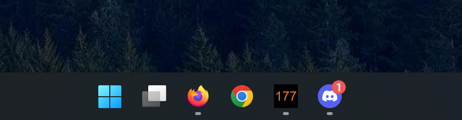

# Glucose Ticker for Windows
Your latest glucose reading. Just a quick
glance away on the Windows Taskbar:

## Requirements

- A **[nightscout site](https://www.nightscout.info)**.  
  This is where Glucose Ticker will get your values. 

- **Windows** 10 or higher.  
  (Looking for a **Mac** alternative?
  Check out [Nightscout OSX Menubar](https://github.com/mddub/nightscout-osx-menubar))

## Download

Get the latest version [here](https://github.com/nielsmaerten/glucose-ticker/releases).

## FAQ

### Understanding "Windows Protected your PC"
Windows SmartScreen can occasionally flag Glucose Ticker as unrecognized due to its limited user base. This is a common security measure for less widely distributed applications. It does not indicate an actual security risk.

#### How to Proceed with the Alert
1. When prompted by SmartScreen, select **More info**.
2. Then choose **Run anyway** to start the Glucose Ticker.

#### So how do I know it's safe?
Want to double-check for peace of mind? You can verify the app's safety by uploading it to [VirusTotal](https://www.virustotal.com/gui/url/0a66fe671d842b7d86e6a11be59f26a6d9cedaca3a21520c1f430c6dad56a5d5). This service scans the file using multiple antivirus programs. It's a straightforward way to see that Glucose Ticker is indeed safe to use.

### Icon not updating correctly?

Give these a try:

- Use the Start Menu or Desktop shortcut to launch the app. 
  Custom shortcuts   should directly target 'Glucose Ticker.exe', not 'glucose-ticker-base.exe'.
- Open the app and minimize it again.
- Ensure the app is **not pinned** to the taskbar.

Issues persisting? Let me know by opening an Issue or starting a discussion on GitHub.

## License

Made with ☕ by Niels Maerten. Licensed under the [MIT](./LICENSE) License.

Found this app helpful? Consider [supporting my caffeine addiction](https://go.niels.me/coffee) to fuel more creations like this.

