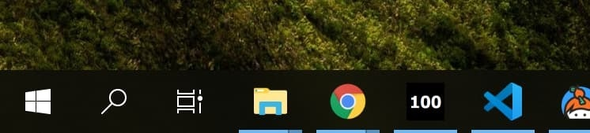

# Nightscout Buddy for Windows

Always see your current blood sugar level on the Taskbar.

Here's what it looks like. More screenshots [here](./SCREENSHOTS.md).

## Download

* [For Windows 10](https://github.com/nielsmaerten/glucose-ticker/releases)
* Looking for a Mac alternative? Check out: https://github.com/mddub/nightscout-osx-menubar

## FAQ

### Windows says this app is unsafe?

TLDR: **Relax; it's fine!** 

Windows shows this warning because the app is not [digitally signed](https://www.google.com/search?q=microsoft+authenticode).

Digitial signatures are expensive, and since this is a hobby-project I didn't want to pay for one.
[Click here](https://www.virustotal.com/gui/url/0a66fe671d842b7d86e6a11be59f26a6d9cedaca3a21520c1f430c6dad56a5d5?nocache=1) for a report from VirusTotal: all virusscanners agree this app is safe.

### My icon isn't updating?

Try the following:

* Make sure you started the app using the shortcut in your Start Menu, or on your Desktop
  * If you create your own shortcut, point it to the .bat file. Shortcuts pointing to the .exe won't work.
* Open the app and minimize it again
* Make sure the app is **not pinned** to the taskbar

Still not working? Open an Issue or post a question in the Discussions on GitHub

## License

Made with ☕ by Niels Maerten. Licensed under the [MIT](./LICENSE) License.

Did you find this app useful? Consider [buying me a coffee](https://go.niels.me/coffee) so I can make more projects like this one :)

## Contributing

Pull requests are welcome :)

